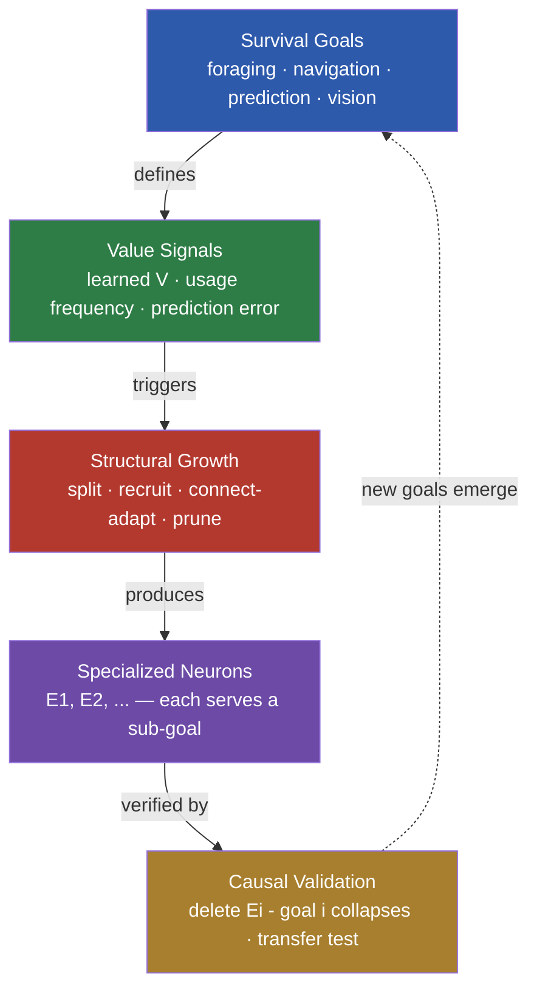
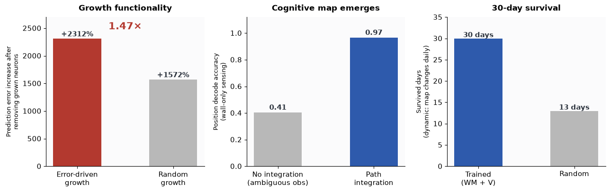
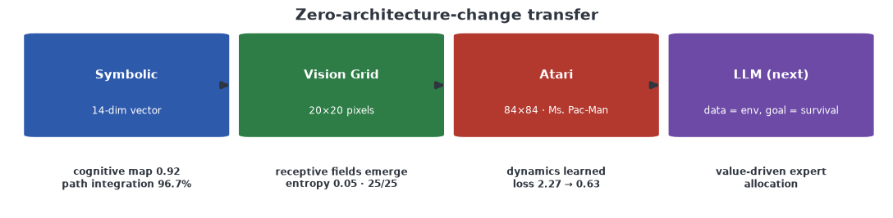

<div align="center">

# 🧠 Goal-Directed Structural Plasticity

### Neurons that *purposefully* grow to serve survival goals

**Neurons don't grow because they "ran out of capacity" — they grow where it matters.**

Driven by value signals that emerge from experience (not pre-defined importance), neurons split, recruit connections, and prune to specialize for different sub-goals — validated by causal deletion: *remove the neuron, its goal collapses.*

---



</div>

## 🧭 Why this research

Biological brains specialize: V1 neurons detect edges at specific locations, hippocampal cells encode places, and circuits rewire as the environment demands. Neural networks — despite being inspired by them — rarely *self-organize* such division of labor. Mixture-of-Experts models assume it, but in practice experts often collapse into generalists. Growing networks add capacity, but the new capacity is rarely *functional*.

**The question that drives this project: how does specialization emerge from experience — and when does it become functional?**

```
分工是大脑的真实组织方式
  → 但神经网络自发涌现分工很难 (专家通才化)
  → 加容量 ≠ 加功能 (生长常是死容量)
  → 什么条件让专精涌现且有功能? 环境能诱导吗? 怎么持久?
```

## 🔗 The research chain (每步: 问题 → 为什么 → 发现)

| # | Question | Why we ran it | Finding |
|:---:|:---|:---|:---|
| **P1** | 专精在哪一层? | 280M 块级 MoE 失败 — 是架构问题还是容量问题? | 神经元级 0.855 ≫ 块级 0.202 — **粒度决定专精** |
| **P2** | 什么训练条件让结构涌现? | 神经元级专精只是记忆 — 功能需要什么? | 预测目标 94.9% vs 策略目标 4.2% — **任务需求决定表征** |
| **P3** | 环境能诱导生长吗? | 生长是"加容量"还是"有目的"? | 误差驱动 1.47× 关键 (删神经元因果); 连接自适应 → 感受野浮现 |
| **P4** | 无地图怎么建立空间? | 没有 GPS 的动物如何导航? | 路径积分 96.7% — **认知地图从运动累积涌现** |
| **P5** | 知识怎么持久? | 动态世界 + 有限脑容量 | 睡眠巩固边界: 片段回放有效, 降标依赖容量; **30 昼夜生存** |
| **P6** | 机制普适吗? | 是玩具特例还是通用原则? | 符号→视觉→Atari 零改动迁移 — **观测无关** |



## 🗺️ Domain transfer



## 🚀 Quick start

```bash
git clone git@github.com:YangYue3417/goal-directed-structural-plasticity.git
cd goal-directed-structural-plasticity

# 1. P4: cognitive map from ambiguous sensing (~15 min)
python world_models/train_wm_explore.py --sensor walls

# 2. P3: visual receptive fields self-organize (~25 min)
python world_models/train_wm_image_v3.py --epochs 25

# 3. P5: 30-day survival in a daily-changing world (~10 min)
python sleep/test_survival_dynamic.py --days 30
```

*Atari: `pip install gymnasium[atari] ale-py opencv-python-headless`, then `python world_models/train_atari_wm.py`*

## 📚 Learn more

| Doc | Content |
|:---|:---|
| **[TECHNICAL.md](docs/TECHNICAL.md)** | Full evidence tables, methods, configs, reproduction |
| **docs/MASTER_SUMMARY.md** | Complete research narrative & finding chain |
| **docs/FINDINGS_growth_functional.md** | Center experiments: growth / survival / transfer / cognition |
| **docs/FINDINGS_world_model.md** | World models, credit assignment, dreaming (M1-M8) |

## 🧩 Architecture

```
observation (symbolic / image)
    → encoder (Linear / spatial-CNN)
    → connection-mask pool (top-k sparse, receptive-field learning) ← grow / prune
    → GRU integration (cognitive map)
    → latent prediction + reward prediction
    → value function + tree search (decision)
    → sleep consolidation (fragment replay / conditional downscale)
```

## 🌐 Future: world-model learning & explaining functional clustering

**应用 — 在世界模型中学习规律。** World models are a frontier direction (Dreamer, Genie, JEPA) for robots, autonomous driving, and increasingly LLMs. Our framework adds what they lack: **structure that adapts to goals**. Capacity is not fixed — it grows where value signals point, and connection masks self-organize into functional units. In an LLM context, where *data = environment* and *training objective = survival*, this maps to value-driven expert allocation and goal-aligned capacity.

**科学 — 解释神经元的"功能性聚类"。** Neuroscience observes that neurons cluster by function: V1 cells tuned to edges at specific locations, hippocampal place cells, even induction heads in LLMs. This project reproduces the *mechanism* behind such clustering:

```
预测任务 → 位置调谐神经元 (隐状态解码 94.9%)
连接掩码 → 空间感受野 (熵 0.05)
误差驱动 → 功能关键神经元 (删了目标崩)
环境统计 → 转换类型专精 (墙/食物/空检测器)
```

**Functional clustering is not an assumption — it is a consequence of what the network must predict.**

## 🔭 Roadmap

- [ ] Value-driven (learned V) vs error-driven growth — which survives better
- [ ] Multi-goal environments → 1:1 neuron-goal mapping purity
- [ ] New goal appears → new specialization follows
- [ ] LLM transfer: streaming domains → value-driven expert allocation
- [ ] Multi-seed statistical rigor

## 📄 License

MIT

---

*Importance is not predefined — it emerges from what keeps you alive.*
