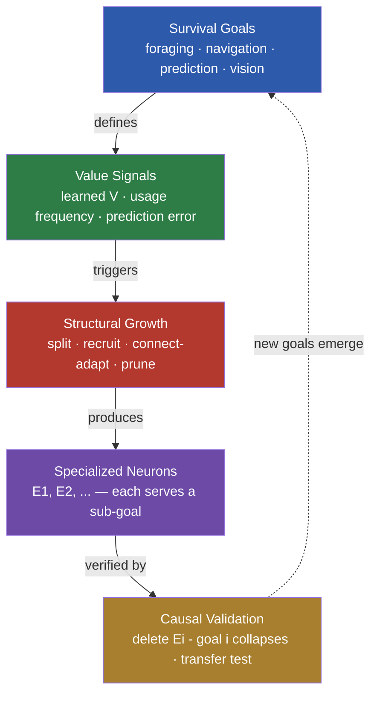

<div align="center">

# 🧠 Goal-Directed Structural Plasticity

### Neurons that *purposefully* grow to serve survival goals

**Neurons don't grow because they "ran out of capacity" — they grow where it matters.**

Driven by value signals that emerge from experience (not pre-defined importance), neurons split, recruit connections, and prune to specialize for different sub-goals — validated by causal deletion: *remove the neuron, its goal collapses.*

---



</div>

## 🧭 Why this research

Biological brains specialize: V1 neurons detect edges at specific locations, hippocampal cells encode places, and circuits rewire as the environment demands. Neural networks — despite being inspired by them — rarely *self-organize* such division of labor. Mixture-of-Experts models assume it, but in practice experts often collapse into generalists. Growing networks add capacity, but the new capacity is rarely *functional*.

**The question that drives this project: how does specialization emerge from experience — and when does it become functional?**

```
division of labor is how brains organize
  → yet NNs rarely self-organize it (experts collapse into generalists)
  → more capacity ≠ more function (growth is often dead capacity)
  → what conditions make specialization emerge & functional?
  → can the environment induce it? how does it persist?
```

## 🔗 The research chain (question → why → finding)

| # | Question | Why we ran it | Finding |
|:---:|:---|:---|:---|
| **P1** | At what level does specialization live? | Block-level MoE failed — architecture or capacity? | Neuron-level 0.855 ≫ block-level 0.202 — **granularity decides specialization** |
| **P2** | What training condition forces structure? | Neuron-level specialization was memory — what makes it functional? | Prediction 94.9% vs policy 4.2% — **task demand shapes representation** |
| **P3** | Can the environment induce growth? | Is growth "adding capacity" or "purposeful"? | Error-driven 1.47× more critical (causal deletion); connection adaptation → receptive fields |
| **P4** | How is space built without a map? | How do animals navigate without GPS? | Path integration 96.7% — **cognitive maps emerge from motion** |
| **P5** | How does knowledge persist? | Dynamic world + finite brain | Sleep boundaries: fragment replay works, downscaling needs capacity pressure; **30-day survival** |
| **P6** | Is the mechanism general? | Toy-specific or universal principle? | Symbolic → vision → Atari, zero architecture change — **observation-agnostic** |


## 🗺️ Domain transfer


## 🚀 Quick start

```bash
git clone git@github.com:YangYue3417/goal-directed-structural-plasticity.git
cd goal-directed-structural-plasticity

# P4: cognitive map from ambiguous sensing (~15 min)
python world_models/train_wm_explore.py --sensor walls

# P3: visual receptive fields self-organize (~25 min)
python world_models/train_wm_image_v3.py --epochs 25

# P5: 30-day survival in a daily-changing world (~10 min)
python sleep/test_survival_dynamic.py --days 30
```

*Atari: `pip install gymnasium[atari] ale-py opencv-python-headless`, then `python world_models/train_atari_wm.py`*

## 📚 Learn more

| Doc | Content |
|:---|:---|
| **[TECHNICAL.md](docs/TECHNICAL.md)** | Full evidence tables, methods, configs, reproduction |
| **docs/MASTER_SUMMARY.md** | Complete research narrative & finding chain |
| **docs/FINDINGS_growth_functional.md** | Center experiments: growth / survival / transfer / cognition |
| **docs/FINDINGS_world_model.md** | World models, credit assignment, dreaming (M1-M8) |

## 🧩 Architecture

```
observation (symbolic / image)
    → encoder (Linear / spatial-CNN)
    → connection-mask pool (top-k sparse, receptive-field learning) ← grow / prune
    → GRU integration (cognitive map)
    → latent prediction + reward prediction
    → value function + tree search (decision)
    → sleep consolidation (fragment replay / conditional downscale)
```

## 🌐 Future: world-model learning & explaining functional clustering

**Application — learning regularities inside a world model.** World models are a frontier direction (Dreamer, Genie, JEPA) for robots, autonomous driving, and increasingly LLMs. Our framework adds what they lack: **structure that adapts to goals**. Capacity is not fixed — it grows where value signals point, and connection masks self-organize into functional units. In an LLM context, where *data = environment* and *training objective = survival*, this maps to value-driven expert allocation and goal-aligned capacity.

**Science — explaining why neurons cluster functionally.** Neuroscience observes that neurons cluster by function: V1 cells tuned to edges at specific locations, hippocampal place cells, even induction heads in LLMs. This project reproduces the *mechanism* behind such clustering:

```
prediction task   → position-tuned neurons  (hidden-state decode 94.9%)
connection masks  → spatial receptive fields (entropy 0.05)
error-driven growth → functionally critical neurons (deletion collapses the goal)
environment stats → transition-type specialists (wall / food / open detectors)
```

**Functional clustering is not an assumption — it is a consequence of what the network must predict.**

## 🔭 Roadmap

- [ ] Value-driven (learned V) vs error-driven growth — which survives better
- [ ] Multi-goal environments → 1:1 neuron-goal mapping purity
- [ ] New goal appears → new specialization follows
- [ ] LLM transfer: streaming domains → value-driven expert allocation
- [ ] Multi-seed statistical rigor

## 📄 License

MIT

---

*Importance is not predefined — it emerges from what keeps you alive.*
