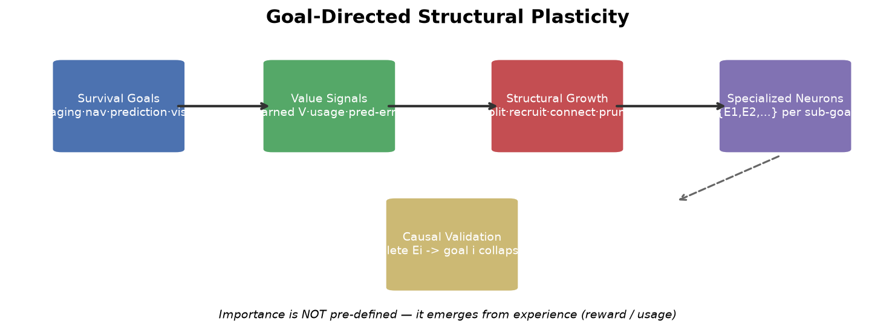

<div align="center">

# 🧠 Goal-Directed Structural Plasticity

### Neurons that *purposefully* grow to serve survival goals

**Neurons don't grow because they "ran out of capacity" — they grow where it matters.**

Driven by value signals that emerge from experience (not pre-defined importance), neurons split, recruit connections, and prune to specialize for different sub-goals — validated by causal deletion: *remove the neuron, its goal collapses.*

---



</div>

## ✨ Why it matters

| | |
|:---|:---|
| 🎯 **Prediction forces structure** | The same network encodes spatial structure at **94.9%** when trained to predict, vs **4.2%** when trained to act |
| 🌱 **Environment-driven growth works** | Error-driven neurons are **1.47× more functionally critical** than random ones (causal deletion) |
| ⚖️ **Survival of the fittest** | With a limited brain, growth + pruning keeps a *crack squad*: survivor activation 0.20 → **0.38** (≈ core neurons) |
| 🗺️ **Cognitive maps emerge without maps** | Path integration localizes at **96.7%** from ambiguous wall-only sensing |
| 👁️ **Receptive fields self-organize** | Connection-mask learning → spatial tuning (entropy 0.05), no pre-set receptive fields |
| 💤 **Sleep has boundary conditions** | Fragment replay keeps memory in dynamic worlds; downscaling only helps under capacity pressure |
| 🏃 **Survives & transfers** | **30 days** in a maze that changes daily, stable across seeds & configs |
| 🚀 **Zero-architecture-change transfer** | Symbolic → pixel grid → **Atari (Ms. Pac-Man)** — same framework, no changes |


## 🗺️ Domain transfer


## 🚀 Quick start

```bash
git clone git@github.com:YangYue3417/goal-directed-structural-plasticity.git
cd goal-directed-structural-plasticity

# 1. Cognitive map from ambiguous sensing (~15 min)
python world_models/train_wm_explore.py --sensor walls

# 2. Visual receptive fields self-organize (~25 min)
python world_models/train_wm_image_v3.py --epochs 25

# 3. 30-day survival in a daily-changing world (~10 min)
python sleep/test_survival_dynamic.py --days 30
```

*Atari: `pip install gymnasium[atari] ale-py opencv-python-headless`, then `python world_models/train_atari_wm.py`*

## 📚 Learn more

| Doc | Content |
|:---|:---|
| **[TECHNICAL.md](docs/TECHNICAL.md)** | Full evidence tables, methods, configs, reproduction |
| **docs/MASTER_SUMMARY.md** | Complete research narrative & finding chain |
| **docs/FINDINGS_growth_functional.md** | Center experiments: growth / survival / transfer / cognition |
| **docs/FINDINGS_world_model.md** | World models, credit assignment, dreaming (M1-M8) |

## 🧩 Architecture

```
observation (symbolic / image)
    → encoder (Linear / spatial-CNN)
    → connection-mask pool (top-k sparse, receptive-field learning) ← grow / prune
    → GRU integration (cognitive map)
    → latent prediction + reward prediction
    → value function + tree search (decision)
    → sleep consolidation (fragment replay / conditional downscale)
```

## 🔭 Roadmap

- [ ] Value-driven (learned V) vs error-driven growth — which survives better
- [ ] Multi-goal environments → 1:1 neuron-goal mapping purity
- [ ] New goal appears → new specialization follows
- [ ] LLM transfer: streaming domains → value-driven expert allocation
- [ ] Multi-seed statistical rigor

## 📄 License

MIT

---

*Importance is not predefined — it emerges from what keeps you alive.*
