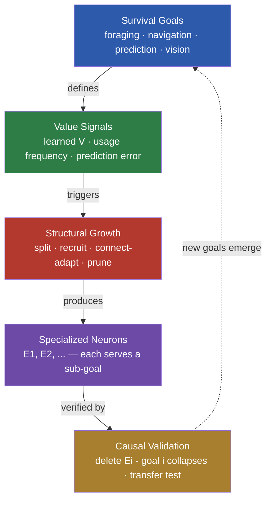

<div align="center">

# 🧠 Goal-Directed Structural Plasticity

### How specialization emerges from experience — and when it becomes functional

---

**Abstract.** Biological brains rewire as the environment demands: V1 neurons form receptive fields, hippocampal cells encode places, and circuits specialize for survival-relevant structure. Neural networks rarely self-organize this way — MoE experts collapse into generalists, and growing networks add dead capacity. We study *when* specialization emerges and becomes functional. Across symbolic, pixel, and Atari domains, we show that **(1)** prediction objectives force structured representations, **(2)** error-driven growth produces functionally critical neurons, **(3)** connection-mask learning self-organizes receptive fields, **(4)** cognitive maps emerge from path integration, and **(5)** consolidation has environment-dependent boundary conditions. All findings are validated by causal deletion and survive in a daily-changing world indefinitely (continuous survival, no fixed horizon).

</div>

## 🧭 Motivation

Division of labor is how brains organize — yet NNs rarely self-organize it. Mixture-of-Experts models *assume* specialization, but in practice experts collapse into generalists; growing networks add capacity, but the new capacity is rarely *functional*. What conditions make specialization emerge — and can the environment induce it?

```
division of labor is how brains organize
  → yet NNs rarely self-organize it (experts collapse into generalists)
  → more capacity ≠ more function (growth is often dead capacity)
  → what conditions make specialization emerge & functional?
  → can the environment induce it? how does it persist?
```

## 🔬 Method



The framework runs a world model (encoder → connection-mask pool → GRU integration → latent prediction) under goal-driven structural growth, with pruning for resource constraints and sleep-based consolidation. Each claim below is validated by causal deletion: remove the specialized neurons and the corresponding goal collapses.

## 📊 Results

The research chain — each step asks *why*:

| # | Question | Why we ran it | Finding |
|:---:|:---|:---|:---|
| **P1** | At what level does specialization live? | Block-level MoE failed — architecture or capacity? | Neuron-level 0.855 ≫ block-level 0.202 — **granularity decides specialization** |
| **P2** | What training condition forces structure? | Neuron-level specialization was memory — what makes it functional? | Prediction 94.9% vs policy 4.2% — **task demand shapes representation** |
| **P3** | Can the environment induce growth? | Is growth "adding capacity" or "purposeful"? | Error-driven 1.47× more critical (causal deletion); connection adaptation → receptive fields |
| **P4** | How is space built without a map? | How do animals navigate without GPS? | Path integration 96.7% — **cognitive maps emerge from motion** |
| **P5** | How does knowledge persist? | Dynamic world + finite brain | Sleep boundaries: fragment replay works, downscaling needs capacity pressure; **continuous survival** |
| **P6** | Is the mechanism general? | Toy-specific or universal principle? | Symbolic → vision → Atari, zero architecture change — **observation-agnostic** |


## 🧩 Architecture: one entry, components guaranteed

A single entry point (`train_gdsp.py`) makes **growth, pruning, and consolidation required runtime components** — migrating to a new domain means swapping the environment, never re-assembling the framework:

```
train_gdsp(env_fn, obs_dim, act_dim)      # swap env to transfer
    → world model (connection-mask pool)  # backbone
    → growth (error-driven)               # automatic, required
    → pruning (usage-based)               # automatic, required
    → consolidation (fragment replay)     # automatic, required
    → decision (learned V + MPC)          # pure framework, no external RL
```

| Domain | Obs → Action | Result |
|:---|:---|:---|
| CartPole | 4-dim → discrete 2 | world model 0.0046, MPC beats random |
| Walker | 24-dim joints → continuous 4 | growth auto-attached (14 neurons); exploration-bound |

## ⚠️ Limitations

Honest boundaries of this work:

1. **Toy-scale validation** — 10×10 mazes and small MNIST; no real-scale experiments yet
2. **Single-seed results** for the headline numbers (1.47×, +42%) — multi-seed statistics pending
3. **Visual growth deletion is noisy** — decode-probe refitting sensitivity; activation rate is the reliable metric
4. **Atari is mechanism-level** — 50K random frames, not a performance benchmark
5. **"Growth = capacity" reversal is task-dependent** — holds for prediction tasks; classification (memory) tasks still work with random growth
6. **Survival is a metaphor at the LLM scale** — "data = environment, objective = survival" is a mapping, not a literal pressure signal

## 🔭 Roadmap

- [ ] Value-driven (learned V) vs error-driven growth — which survives better
- [ ] Multi-goal environments → 1:1 neuron-goal mapping purity
- [ ] New goal appears → new specialization follows
- [ ] LLM transfer: streaming domains → value-driven expert allocation
- [ ] Multi-seed statistical rigor

## 🧩 Future: world-model learning & explaining functional clustering

**Application — learning regularities inside a world model.** World models are a frontier direction (Dreamer, Genie, JEPA) for robots, autonomous driving, and increasingly LLMs. Our framework adds what they lack: **structure that adapts to goals**. Capacity is not fixed — it grows where value signals point, and connection masks self-organize into functional units. In an LLM context, where *data = environment* and *training objective = survival*, this maps to value-driven expert allocation and goal-aligned capacity.

**Science — explaining why neurons cluster functionally.** Neuroscience observes that neurons cluster by function: V1 cells tuned to edges at specific locations, hippocampal place cells, even induction heads in LLMs. This project reproduces the *mechanism* behind such clustering:

```
prediction task   → position-tuned neurons  (hidden-state decode 94.9%)
connection masks  → spatial receptive fields (entropy 0.05)
error-driven growth → functionally critical neurons (deletion collapses the goal)
environment stats → transition-type specialists (wall / food / open detectors)
```

*Functional clustering is not an assumption — it is a consequence of what the network must predict.*

## 🔁 Reproduction

```bash
git clone git@github.com:YangYue3417/goal-directed-structural-plasticity.git
cd goal-directed-structural-plasticity

# P4: cognitive map from ambiguous sensing (~15 min)
python world_models/train_wm_explore.py --sensor walls

# P3: visual receptive fields self-organize (~25 min)
python world_models/train_wm_image_v3.py --epochs 25

# P5: continuous survival in a daily-changing world (~10 min)
python sleep/test_survival_dynamic.py --days 100   # no fixed horizon — always survive

# Unified entry: growth/pruning automatic — swap env to transfer
python train_gdsp.py --env cartpole   # 4-dim state, discrete action
python train_gdsp.py --env walker     # 24-dim joints, continuous action
```

*Atari: `pip install gymnasium[atari] ale-py opencv-python-headless`, then `python world_models/train_atari_wm.py`*

All experiment configurations are centralized in [`config.py`](config.py). Full evidence tables in [TECHNICAL.md](docs/TECHNICAL.md).

## 📚 Documentation

| Doc | Content |
|:---|:---|
| **[TECHNICAL.md](docs/TECHNICAL.md)** | Evidence tables, methods, configs, full reproduction |
| **docs/MASTER_SUMMARY.md** | Research narrative & finding chain (中文) |
| **docs/FINDINGS_growth_functional.md** | Center experiments: growth / survival / transfer (中文) |
| **docs/FINDINGS_world_model.md** | World models, credit assignment, dreaming (中文) |

## 📖 Citation

```bibtex
@software{goal_directed_structural_plasticity,
  title = {Goal-Directed Structural Plasticity},
  author = {Yang, Yue},
  year = {2026},
  url = {https://github.com/YangYue3417/goal-directed-structural-plasticity},
}
```

## 📄 License

MIT

---

*Importance is not predefined — it emerges from what keeps you alive.*
